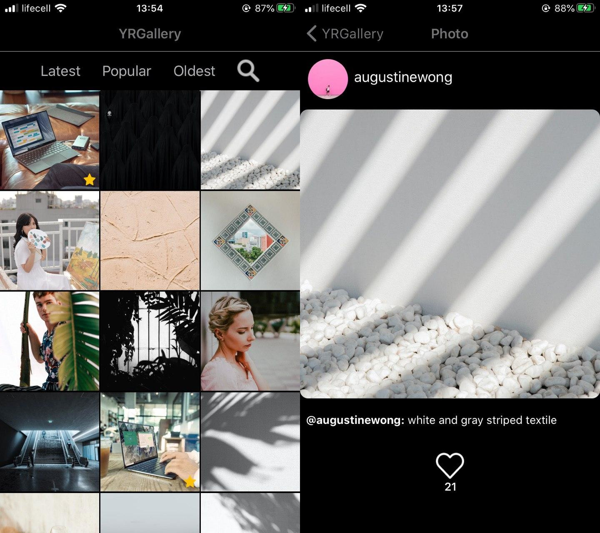
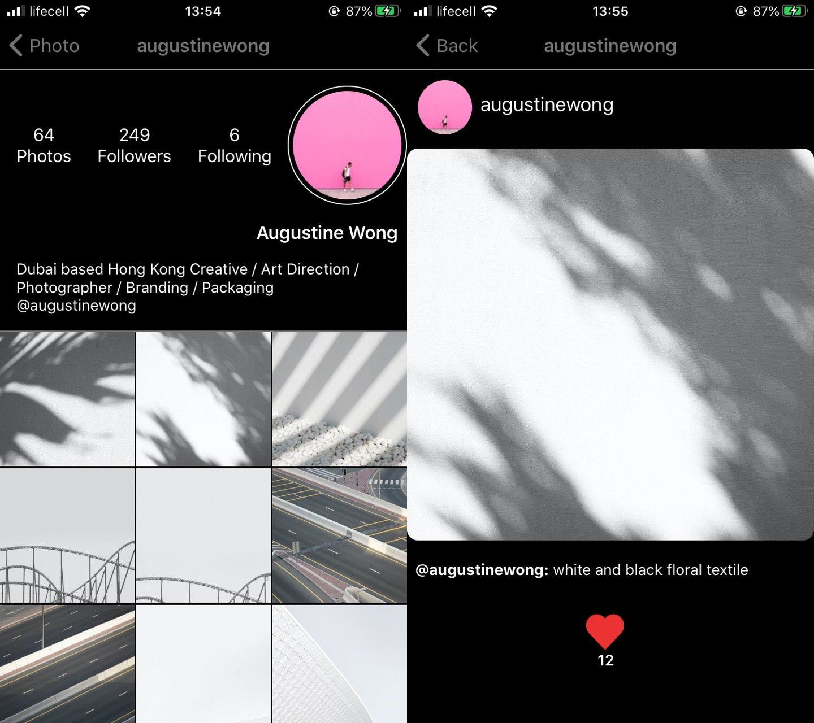

# YRGallery

YRGallery is a simple mobile app, which work with [unsplash](https://unsplash.com/) api. You can get 30 new, old or most popular photos, and information about them, like author and comment. Also you can find photos with key-word help, and visit user profile, with his own portfolio.

## Installation

Use the package manager [npm](https://www.npmjs.com/) to install all dependencies ([React](https://reactjs.org/), [React Native](https://reactnative.dev/), [expo](https://expo.io/)) after you clone repository. You need [Node.js](https://nodejs.org/uk/) to use npm.

```bash
git clone https://github.com/koffis/react-native-test-app.git
cd YRGallery
npm install 
```

## Usage

After you clone repository and installed dependencies, start project with 'npm start' or 'expo start' 

```node.js
npm start
/*or*/
expo start
```
## Preview
You can see how an app looks like on this screenshots.

### IOS




### video presentation 


## Enjoy
It's my first mobile app, so don't be rude)
I`d like to make more functional in future, and also make some another mobile apps.

## License
[MIT](https://choosealicense.com/licenses/mit/)
